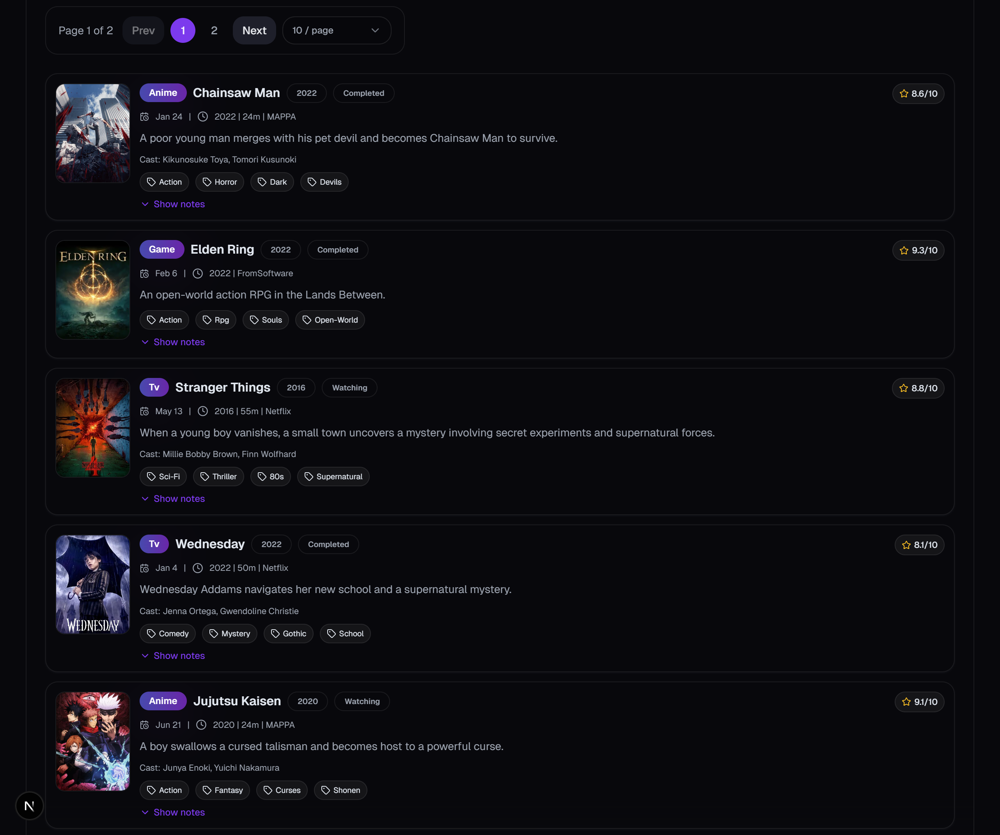
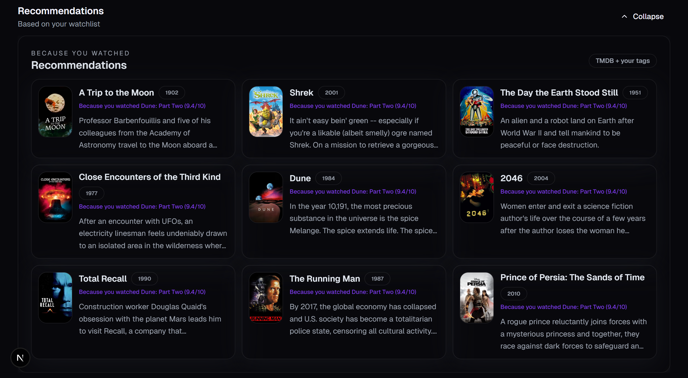
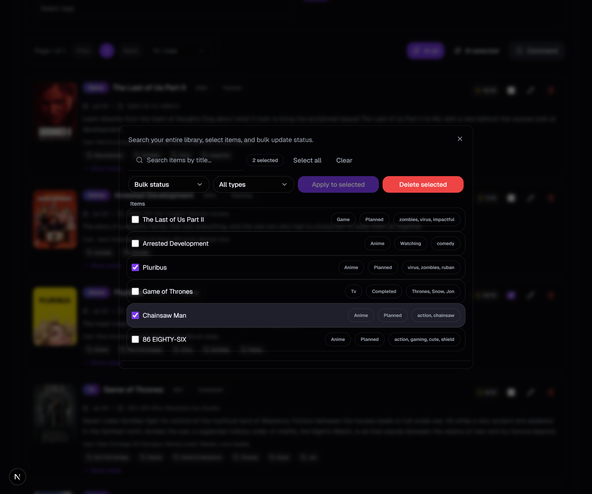
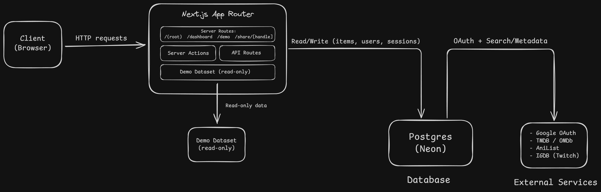

# Cosmic Watchlist

Premium, server-first watchlist for anime, movies, TV, and games. Fast CRUD, shareable filters, and smart stats.

[](https://stargazers-cosmic-watchlist.vercel.app/?utm_source=github&utm_medium=readme&utm_campaign=career-portfolio-2026&utm_content=badge)


## Demo
- Live: [Open live demo](https://stargazers-cosmic-watchlist.vercel.app/?utm_source=github&utm_medium=readme&utm_campaign=career-portfolio-2026&utm_content=demo)

## Screenshots

<p align="center">
  
</p>

<p align="center">
  
  
</p>



## Architecture



## Tradeoffs
Serverless hosting keeps costs low and scales cleanly without always-on servers. It reduces ops overhead and is a good fit here, even though it is not ideal for every workload.\n\nTradeoff notes:\n- Cold starts can add latency for rarely-hit routes.\n- Long-running jobs and heavy background processing are a poor fit without external workers.\n- You trade fine-grained server tuning for simplicity and lower cost.

## Features
- Server-first CRUD with type-safe validation (Zod) and Server Actions.
- Shareable filters via URL params.
- Smart stats: completion rate, runtime totals, activity heatmap, and breakdowns.
- Optional enrichment + recommendations (TMDB/OMDb).
- Google sign-in via Auth.js/NextAuth v5 beta with Postgres sessions.

## Stack
Next.js 16 App Router · React 19 · TypeScript · Tailwind CSS · Drizzle ORM · PostgreSQL · Auth.js

## Quickstart

```bash
cd Stargazers-Cosmic-Watchlist
npm install
cp .env.example .env.local
npm run db:push
npm run db:seed
npm run dev
```

Open `http://localhost:3000`.

## Config

Required:
- `DATABASE_URL`
- `GOOGLE_CLIENT_ID`
- `GOOGLE_CLIENT_SECRET`
- `NEXTAUTH_SECRET`

Optional:
- `NEXT_PUBLIC_GA_MEASUREMENT_ID`
- `TMDB_API_KEY`
- `OMDB_API_KEY`
- `OPENAI_API_KEY`
- `IGDB_CLIENT_ID`
- `IGDB_CLIENT_SECRET`
- `ADMIN_EMAILS`
